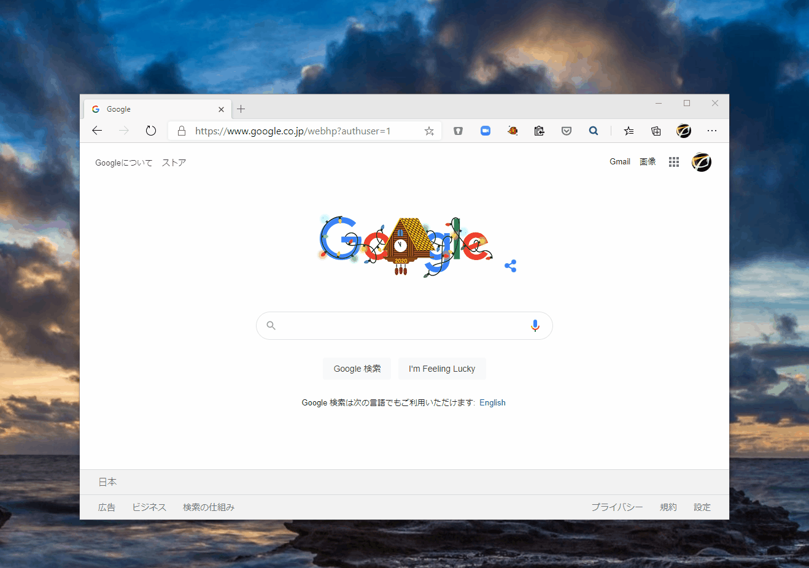
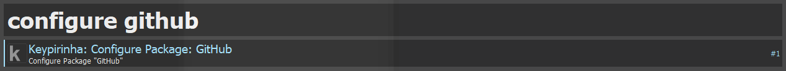
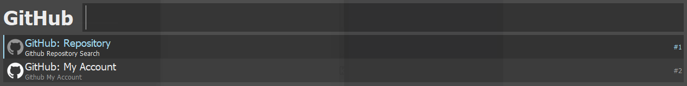
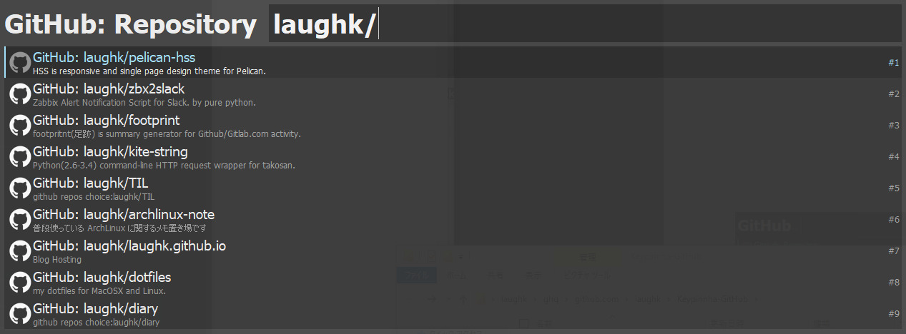
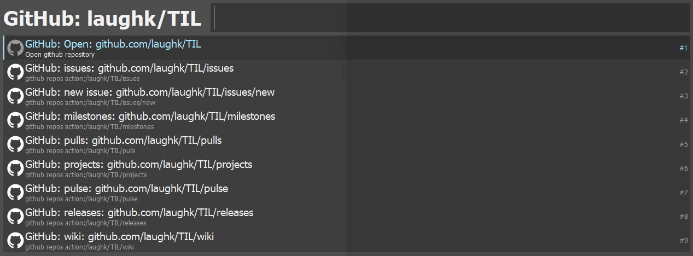
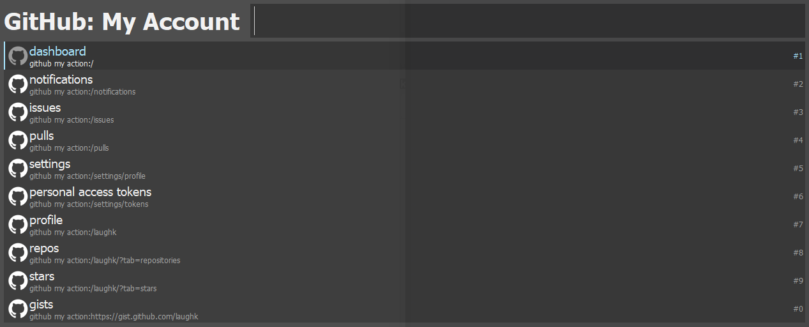

# Keypirinha Plugin: GitHub



This is a plugin for the [Keypirinha](http://keypirinha.com) launcher.

It provide command to quick access to repository and your account page of github.com. 

###  Inspire of

- [gharlan/alfred-github-workflow: GitHub Workflow for Alfred 3/4](https://github.com/gharlan/alfred-github-workflow)
- [buty4649/ulauncher-github-extension: Github extension for Ulauncher](https://github.com/buty4649/ulauncher-github-extension)


## Download

https://github.com/laughk/keypirinha-GitHub/releases


## Install

Once the `github.keypirinha-package` file is installed,
move it to the `InstalledPackage` folder located at:

* `Keypirinha\portable\Profile\InstalledPackages` in **Portable mode**
* **Or** `%APPDATA%\Keypirinha\InstalledPackages` in **Installed mode** (the
  final path would look like
  `C:\Users\%USERNAME%\AppData\Roaming\Keypirinha\InstalledPackages`)

## Setup

1.  Get your github personal access token with below scope  from [this page]([Personal Access Tokens (github.com)](https://github.com/settings/tokens)).

   - `repo` (if you want use with private repository)
   - `user read:user` 

2. Put github personal access token to config file. like below.

   1. input "configure github" on Keyperinha and open config file.

      

   2. set the token to `github_access_token` in `[var]` and save.

      ```dosini
      [var]
      github_access_token = ****************************
      ```

## Usage

#### 1. Select Repository or Your (My) Account



#### 2. GitHub Repository: Select github repository and page.

Case of select "GitHub: Repository". this is provide quick access to repository.

suggestions will appear. these is result that is github repository search with graphql api by input text. select one.



select page of the repository from suggestions.



#### 3. GitHub My Account: Select your account page

Case of select "GitHub: My Account". this is provide quick access to your account page.



